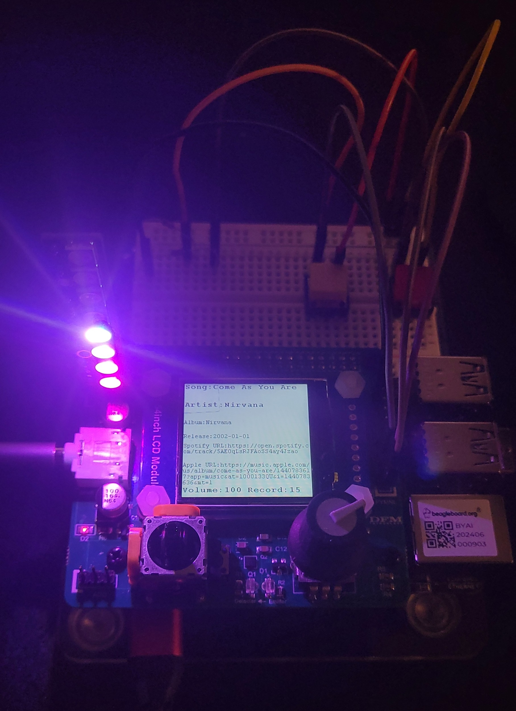

# Music-BeagleYAI

Music-BeagleYAI is an embedded music recognition and synthesis project using the BeagleY-AI board and a Python backend. It enables users to record audio clips, identify songs using the AudD API, download the full track from YouTube, and play it back with real-time LED visualizations and interactive hardware controls. It combines audio preocessing, machine learning, embedded system, and visual feedback into an interactive music experience.



## Features

- 🎙️ **Audio Recognition**: Record audio and identify the song using the [AudD API](https://audd.io/).
- 📥 **Song Downloading**: Download identified songs from YouTube and transcode them to `.wav` using FFMPEG.
- 🔁 **Client-Server Communication**: Robust TCP socket communication between BeagleY-AI and the Python server.
- 🕹️ **Interactive Controls**:
  - **Rotary Encoder**: Set and trigger the duration of recording.
  - **Joystick**: 
    - X-axis to navigate the recognized song list.
    - Y-axis to control volume.
    - Press to play/pause the current song.
  - **NeoPixels**: Built on the Arm Cortex-R5 processor to visualize real-time audio amplitude as a colorful light bar.
  - **Switches**: Skip forward or backward by 10 seconds during playback.
- 📺 **LCD Display**: Show song metadata including:
  - Title
  - Artist
  - Release date
  - Spotify link

## Project Structure
    .
    │
    ├── server/                    # Python backend for song recognition and download
    │   ├── audd_api.py            # Handles AudD API 
    │   ├── song_recognition.py    # YouTube download and  converts audio formats
    │   └── TCP_server.py          # TCP communication logic
    │
    ├── test_python_client/        # Python client to test the server
    │
    ├── hardware/                  # BeagleY-AI code and circuit schematics
    │   ├── app/                   # Application code for BeagleY-AI
    │   ├── hal/                   # HAL modules for BeagleY-AI
    │   ├── r5/                    # Controls the R5, maps memory to Linux
    │   └── lcd/ lgpio/            # Cross compile libraries
    │
    ├── requirement.txt            # Python dependencies
    └── README.md           


## Setup & Installation

### Server

1. Clone the repository:

    ```bash
    git clone https://github.com/Jloon02/Music-BeagleYAI.git
    ```

2. Install dependencies:

    ```bash
    pip install -r requirements.txt
    ```

3. Set your AudD API token:

    ```bash
    export AUDD_API_TOKEN="your_token_here"
    ```

4. Ensure `ffmpeg` is installed and accessible in your system's PATH.

5. Start the server:

    ```bash
    cd Music-BeagleYAI/server
    python tcp_server.py
    ```

### Client (BeagleY-AI)
See README.md in hardware for details about compiling
1. Cross compile using CMake onto target from host
2. Build the R5 onto target:
    ```bash
    ./r5_mcu_build.sh
    ```
3. ssh into BeagleY-AI
4. Mount NFS and load firmware on MCU R5:
    ```bash
    sudo mount -t nfs 192.168.7.1:/home/path/to/folder /mnt/remote
    ./r5_mcu_build.sh
    ```
5. Start the program:
    ```bash
    ./music_board
    ```


## Example Usage

1. Use the rotary encoder to set the duration of the audio recording.
2. Press the encoder to begin recording.
3. The BeagleY-AI sends the audio to the server.
4. The server recognizes the song, downloads and processes it, and sends back the WAV file and metadata.
5. The BeagleY-AI plays the audio, displays the metadata on the LCD, and visualizes the audio with NeoPixels.
6. Use the joystick and switches to control playback.

## Tech Stack

- Python 3
- C
- AudD API
- FFMPEG
- YouTubeDL
- BeagleY-AI
- Arm Cortex-R5 processor
- Rotary encoder, joystick, LCD, NeoPixels, Circuit bread board, switches

## License

This project is licensed under the MIT License.
